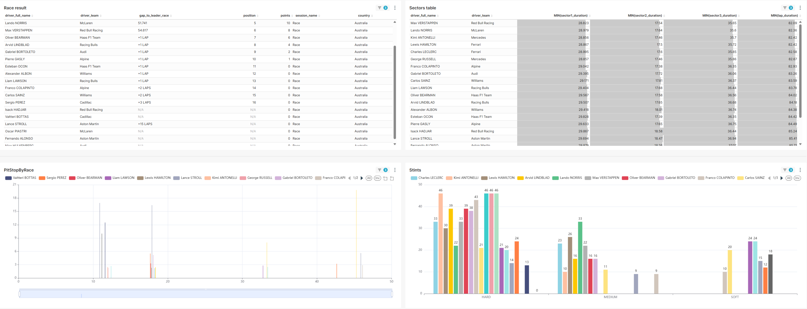
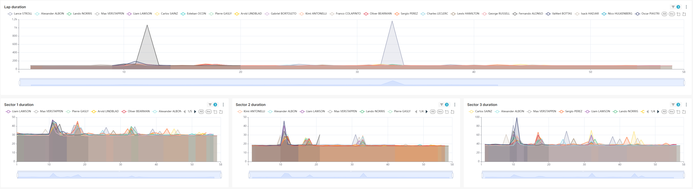
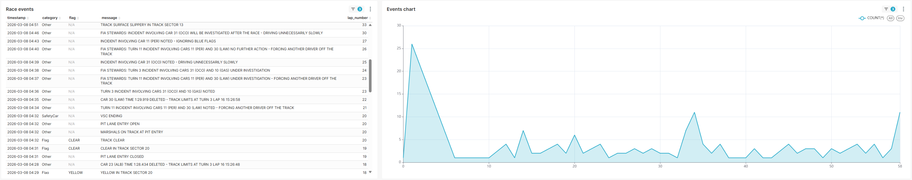
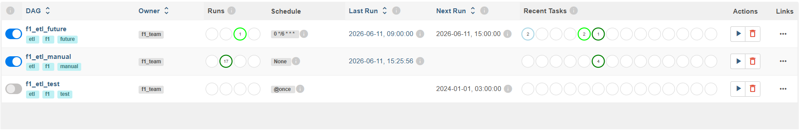

# 🏎️ F1 Teleris — Formula 1 Data Pipeline


**F1 Teleris** — production-ready data pipeline для сбора, трансформации и анализа данных Formula 1 из OpenF1 API с использованием Airflow, MongoDB, PostgreSQL, ClickHouse и Superset.

---

## 📋 Оглавление

- [Quick Start](#-quick-start)
- [Архитектура](#️-архитектура)
- [Структура репозитория](#️-структура-репозитория)
- [Технологический стек](#️-технологический-стек)
- [Модель данных](#️-модель-данных)
- [ETL Pipeline](#-etl-pipeline)
- [Мониторинг и качество данных](#-мониторинг-и-качество-данных)
- [API Endpoints](#-api-endpoints)
- [Галерея](#-галерея)

---

## ⚡ Quick Start

### 1. Клонирование репозитория

```bash
git clone https://github.com/JustDesoto/TMS_F1Teleris.git
cd TMS_F1Teleris
```

### 2. Настройка окружения

```bash
cp .env.example .env
# При необходимости отредактируйте пароли и параметры
```

### 3. Запуск всех сервисов

```bash
docker-compose up -d
```

Это поднимет 8 сервисов:
- MongoDB (raw data)
- PostgreSQL (DDS слой)
- PostgreSQL (метабаза Airflow)
- ClickHouse (OLAP слой)
- Apache Superset (BI)
- Airflow Webserver + Scheduler + Init

### 4. Запуск ETL пайплайна

```bash
# Тест подключений
docker exec f1_airflow_webserver airflow dags trigger f1_etl_test

# Ручной запуск для конкретной сессии
docker exec f1_airflow_webserver airflow dags trigger -c '{"session_key": 11280}' f1_etl_manual
```
Также запустить DAG можно через Web UI Airflow (http://localhost:8080, admin/admin) — выберите DAG и нажмите кнопку **Trigger DAG**, для `f1_etl_manual` дополнительно укажите конфиг `{"session_key": 11280}`.

### 5. Остановка

```bash
docker-compose down -v  # Остановка с удалением томов (чистый старт)
```

---

## 🏗️ Архитектура

```
┌──────────────────────────────────────────────────────────────────────────┐
│                            OpenF1 API                                    │
│                    (sessions, car_data, positions, laps, ...)            │
└──────────────────────────────────────────────────────────────────────────┘
                                      │
                                      ▼
┌──────────────────────────────────────────────────────────────────────────┐
│  Extractors Layer                                                        │
│  ┌─────────────────────┐    ┌─────────────────────────────────────────┐  │
│  │  OpenF1Extractor    │    │ ExtractOrchestrator                     │  │
│  │  (HTTP client)      │    │  • Управление процессом извлечения      │  │
│  └─────────────────────┘    │  • Batch processing (10k записей)       │  │
│                             └─────────────────────────────────────────┘  │
└──────────────────────────────────────────────────────────────────────────┘
                                      │
                                      ▼
┌──────────────────────────────────────────────────────────────────────────┐
│                    MongoDB (Raw Layer)                                   │
│  • 15 коллекций с индексами                                              │
│  • Дедупликация через etl_hash (SHA256)                                  │
│  • Watermarking для инкрементальной загрузки                             │
└──────────────────────────────────────────────────────────────────────────┘
                                      │
                                      ▼
┌──────────────────────────────────────────────────────────────────────────┐
│  Transformers Layer                                                      │
│  ┌────────────────────────────────────────────────────────────────────┐  │
│  │                    DDSTransformOrchestrator                        │  │
│  │  • Загрузка raw данных из MongoDB                                  │  │
│  │  • Получение session_context и drivers_context                     │  │
│  │  • Вызов специализированных трансформеров                          │  │
│  └────────────────────────────────────────────────────────────────────┘  │
│                                      │                                   │
│         ┌────────────────────────────┼────────────────────────────┐      │
│         ▼                            ▼                            ▼      │
│  ┌──────────────┐           ┌──────────────┐           ┌──────────────┐  │
│  │    DDS       │           │    Fact      │           │   Custom     │  │
│  │ Transformers │           │ Transformers │           │  Fields      │  │
│  │ (PostgreSQL) │           │ (ClickHouse) │           │  • points    │  │
│  └──────────────┘           └──────────────┘           │  • is_leader │  │
│                                                        │  • is_wet    │  │
│                                                        └──────────────┘  │
└──────────────────────────────────────────────────────────────────────────┘
                                      │
              ┌───────────────────────┴───────────────────────┐
              ▼                                               ▼
┌─────────────────────────┐                   ┌─────────────────────────┐
│   PostgreSQL (DDS)      │                   │   ClickHouse (OLAP)     │
│  ┌───────────────────┐  │                   │  ┌───────────────────┐  │
│  │ dim_session       │  │                   │  │ fact_car_data     │  │
│  │ dim_meeting_*     │  │                   │  │ fact_position     │  │
│  │ dim_driver_*      │  │                   │  │ fact_lap          │  │
│  │ fact_starting_grid│  │                   │  │ fact_pit_stop     │  │
│  │ fact_session_result│ │                   │  │ fact_weather      │  │
│  └───────────────────┘  │                   │  │ fact_overtake     │  │
│  • SCD Type 0           │                   │  │ fact_stint        │  │
│  • ON CONFLICT DO NO... │                   │  │ fact_location     │  │
└─────────────────────────┘                   └─────────────────────────┘
              │                                               │
              └───────────────────┬───────────────────────────┘
                                  ▼
┌──────────────────────────────────────────────────────────────────────────┐
│                    Apache Superset (BI Layer)                            │
│  • Дашборды: Race Dashboard, Driver Analytics, Team Performance          │
│  • Подключение к ClickHouse через clickhouse-driver                      │
│  • Автоматический импорт дашбордов при старте                            │
└──────────────────────────────────────────────────────────────────────────┘
```

---

## 🗂️ Структура репозитория

```text
TMS_F1Teleris/
├── orchestrators/              # Airflow DAGs
│   └── dags/
│       ├── f1_etl_manual.py           # Ручной запуск ETL
│       ├── f1_etl_future.py           # Автоматический ETL для будущих сессий
│       ├── f1_etl_test.py             # Тест подключений
│
├── extractors/                 # Извлечение данных из API
│   ├── openf1_extractor.py     # Клиент OpenF1 API
│   └── orchestrator.py         # Оркестрация извлечения
│
├── transformers/               # Трансформация данных
│   ├── base_transformer.py     # Базовый класс трансформера
│   ├── dds_transformer.py      # Главный трансформер
│   ├── orchestrator.py         # Оркестрация трансформации
│   ├── dds/                    # Измерения (PostgreSQL)
│   │   ├── meeting_transformer.py
│   │   ├── session_transformer.py
│   │   ├── driver_transformer.py
│   │   ├── starting_grid_transformer.py
│   │   └── session_result_transformer.py
│   └── fact/                   # Факты (ClickHouse)
│       ├── car_data_transformer.py
│       ├── position_transformer.py
│       ├── lap_transformer.py
│       ├── pit_stop_transformer.py
│       ├── interval_transformer.py
│       ├── weather_transformer.py
│       ├── race_control_transformer.py
│       ├── overtake_transformer.py
│       ├── stint_transformer.py
│       └── location_transformer.py
│
├── loaders/                    # Загрузка в БД
│   └── dds_loader.py           # Загрузчик DDS слоя
│
├── repositories/               # Абстракция доступа к данным
│   ├── base_repository.py      # Базовый интерфейс
│   ├── mongo_repository.py     # MongoDB (raw данные)
│   ├── pg_repository.py        # PostgreSQL (измерения)
│   └── ch_repository.py        # ClickHouse (факты)
│
├── models/                     # Pydantic модели
│   └── raw/
│       ├── openf1_base.py
│       ├── openf1_sessions.py
│       ├── openf1_meetings.py
│       ├── openf1_drivers.py
│       ├── openf1_car_data.py
│       ├── openf1_position.py
│       ├── openf1_laps.py
│       ├── openf1_pit.py
│       ├── openf1_weather.py
│       ├── openf1_race_control.py
│       ├── openf1_overtakes.py
│       ├── openf1_stints.py
│       └── openf1_location.py
│
├── config/                     # Конфигурация
│   └── settings.py             # Pydantic settings
│
├── init/                       # Инициализация БД
│   ├── init-mongo.js
│   ├── init-postgres.sql
│   └── init-clickhouse.sh
│   └── init-superset.sh
│
├── superset/                   # Дашборды Superset
│   └── dashboards/
│
├── docker-compose.yml          # Оркестрация сервисов
├── requirements.txt            # Python зависимости
├── .env.example                # Пример переменных окружения
└── README.md
```

---

## 🛠️ Технологический стек

| Компонент | Технология | Версия |
|-----------|-----------|--------|
| **Orchestration** | Apache Airflow | 2.8.1 |
| **Raw Storage** | MongoDB | 7.0 |
| **DDS (Dimensions)** | PostgreSQL | 15 |
| **OLAP (Facts)** | ClickHouse | 23.8 |
| **BI** | Apache Superset | 3.1.0 |
| **Containerization** | Docker + Docker Compose | 24.0+ |
| **Data Validation** | Pydantic | 2.5.0 |
| **API Client** | Requests | 2.31.0 |
| **MongoDB Driver** | PyMongo | 4.5.0 |
| **PostgreSQL Driver** | psycopg2-binary | 2.9.9 |
| **ClickHouse Driver** | clickhouse-driver | 0.2.6 |
| **Settings** | pydantic-settings | 2.1.0 |

---

## 🗄️ Модель данных

### PostgreSQL (DDS — измерения)

| Таблица | Трансформер | Первичный ключ | Описание |
|---------|-------------|----------------|----------|
| `dim_session` | `SessionTransformer` | `session_key` | Сессии (гонка, квалификация, практика) |
| `dim_meeting_session` | `MeetingTransformer` | `(meeting_key, session_key)` | Этапы чемпионата |
| `dim_driver_session` | `DriverTransformer` | `(session_key, driver_number)` | Пилоты в сессии |
| `fact_starting_grid` | `StartingGridTransformer` | `(session_key, driver_number)` | Стартовая решетка |
| `fact_session_result` | `SessionResultTransformer` | `(session_key, driver_number)` | Результаты сессии |

### ClickHouse (OLAP — факты с денормализацией)

| Таблица | Трансформер | Денормализация | Вычисляемые поля |
|---------|-------------|----------------|------------------|
| `fact_car_data` | `CarDataTransformer` | driver + session | `is_speed_high`, `is_full_throttle`, `is_braking` |
| `fact_position` | `PositionTransformer` | driver + session | `is_leader`, `is_podium`, `points` |
| `fact_lap` | `LapTransformer` | driver + session | `lap_time_seconds` |
| `fact_pit_stop` | `PitStopTransformer` | driver + session | — |
| `fact_interval` | `IntervalTransformer` | driver + session | `is_lapped` |
| `fact_weather` | `WeatherTransformer` | session | `track_temp_air_diff`, `is_wet` |
| `fact_race_control` | `RaceControlTransformer` | driver + session | `is_safety_car`, `is_red_flag`, `is_yellow_flag` |
| `fact_overtake` | `OvertakeTransformer` | driver + session | — |
| `fact_stint` | `StintTransformer` | driver + session | `total_laps`, `is_wet_tyre`, `is_soft/medium/hard` |
| `fact_location` | `LocationTransformer` | driver + session | — |

---

## 🔄 ETL Pipeline

### Типы DAG-ов

| DAG | Schedule | Назначение |
|-----|----------|------------|
| `f1_etl_manual` | `None` (manual) | Ручная перезаливка конкретной сессии |
| `f1_etl_future` | `0 */6 * * *` | Автоматический ETL для будущих сессий |
| `f1_etl_test` | `@once` | Проверка подключений к БД |
| `f1_post_session_etl` | `@once` | Пост-сессионный ETL (динамический) |

### Процесс ETL

```python
# 1. Extract: OpenF1 API → MongoDB
orchestrator = ExtractOrchestrator(mongo_repo)
orchestrator.process_session(
    session_key=11280,
    fetch_car_data=True,
    fetch_positions=True,
    fetch_laps=True,
    fetch_pit_stops=True,
    fetch_weather=True,
    fetch_overtakes=True,
    fetch_stints=True,
    fetch_location=True
)

# 2. Transform: MongoDB → DDS (денормализация)
orchestrator = DDSTransformOrchestrator(mongo_repo, pg_repo, ch_repo)
orchestrator.process_session(session_key=11280)

# 3. Load: PostgreSQL + ClickHouse
# Автоматически через DDSLoader
```

### Очередь сессий (etl_session_queue)

```sql
CREATE TABLE etl_session_queue (
    session_key INT PRIMARY KEY,
    status VARCHAR(20),  -- 'pending', 'processing', 'done', 'failed'
    session_name VARCHAR(255),
    date_end TIMESTAMP,
    created_at TIMESTAMP DEFAULT NOW(),
    updated_at TIMESTAMP
);
```

---

## 📊 Мониторинг и качество данных

### Дедупликация
- Каждый документ в MongoDB имеет `etl_hash` (SHA256)
- Unique индексы на `etl_hash` во всех коллекциях
- PostgreSQL использует `ON CONFLICT DO NOTHING`

### Watermarking
- `etl_watermark` для инкрементальной загрузки
- `etl_loaded_at` / `transformed_at` для аудита

### Healthchecks (docker-compose.yml)

```yaml
mongodb:
  healthcheck:
    test: ["CMD", "mongosh", "--eval", "db.adminCommand('ping')"]
    
postgres:
  healthcheck:
    test: ["CMD-SHELL", "pg_isready -U f1_user"]
    
clickhouse:
  healthcheck:
    test: ["CMD", "wget", "--spider", "-q", "http://localhost:8123/ping"]
    
airflow_webserver:
  healthcheck:
    test: ["CMD", "curl", "-f", "http://localhost:8080/health"]
```

---

## 🔌 API Endpoints

### OpenF1 API (используемые эндпоинты)

| Endpoint | Коллекция MongoDB | Описание |
|----------|-------------------|----------|
| `/v1/sessions` | `sessions` | Информация о сессиях |
| `/v1/meetings` | `meetings` | Информация об этапах |
| `/v1/drivers` | `drivers` | Пилоты в сессии |
| `/v1/car_data` | `car_data` | Телеметрия (скорость, RPM, throttle, brake) |
| `/v1/position` | `position` | Позиции гонщиков |
| `/v1/laps` | `laps` | Данные по кругам |
| `/v1/pit` | `pit` | Пит-стопы |
| `/v1/weather` | `weather` | Погодные условия |
| `/v1/race_control` | `race_control` | События гонки (SC, флаги) |
| `/v1/overtakes` | `overtakes` | Обгоны |
| `/v1/stints` | `stints` | Стенты шин |
| `/v1/location` | `location` | GPS координаты |
| `/v1/starting_grid` | `starting_grid` | Стартовая решетка |
| `/v1/session_result` | `session_result` | Результаты сессии |

---

## 🧪 Галерея










---

## 👨‍💻 Автор

**Горностай Анатолий**  
GitHub: [@JustDesoto](https://github.com/JustDesoto)

---

## 🙏 Благодарности

- [OpenF1](https://openf1.org/) за бесплатный API
- Сообществу Apache Airflow, Superset и ClickHouse

---

## 📄 Лицензия

MIT License

---

**Built with ❤️ for Formula 1 and Data Engineering**
